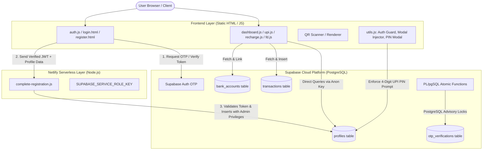

# PayMoney — Comprehensive Project Documentation & Architecture Guide

Welcome to the official documentation for **PayMoney**, a full-featured, bank-grade digital wallet, UPI transfer, and utility bill payments platform built with a high-performance static frontend, Supabase PostgreSQL backend, and Netlify Serverless Functions.

---

## Table of Contents
1. [Project Overview & Key Objectives](#1-project-overview--key-objectives)
2. [Technology Stack](#2-technology-stack)
3. [System Architecture & Data Flow](#3-system-architecture--data-flow)
4. [File & Directory Structure](#4-file--directory-structure)
5. [Core Features & Modules In-Depth](#5-core-features--modules-in-depth)
   - [5.1 Landing & Marketing Suite](#51-landing--marketing-suite)
   - [5.2 Authentication & Two-Factor Verification](#52-authentication--two-factor-verification)
   - [5.3 Wallet Management & Dashboard](#53-wallet-management--dashboard)
   - [5.4 Unified Payments Interface (UPI) & Bank Accounts](#54-unified-payments-interface-upi--bank-accounts)
   - [5.5 QR Code Ecosystem (Display & Dual-Engine Scanner)](#55-qr-code-ecosystem-display--dual-engine-scanner)
   - [5.6 Fixed Deposit (FD) Investment Portal](#56-fixed-deposit-fd-investment-portal)
   - [5.7 Utility & Bill Payments Engine](#57-utility--bill-payments-engine)
   - [5.8 Profile, Security & KYC Management](#58-profile-security--kyc-management)
   - [5.9 Cashback, Discounts & Offers Hub](#59-cashback-discounts--offers-hub)
   - [5.10 Customer Support & Interactive AI Chatbot](#510-customer-support--interactive-ai-chatbot)
6. [Database Schema & Stored Procedures](#6-database-schema--stored-procedures)
7. [Security Model & Hardening](#7-security-model--hardening)
8. [Local Development & Deployment Guide](#8-local-development--deployment-guide)

---

## 1. Project Overview & Key Objectives

**PayMoney** is modeled after premier Indian fintech ecosystems (such as Paytm, PhonePe, and Google Pay). It provides an end-to-end simulated financial environment featuring peer-to-peer payments, utility recharges, bank linking, fixed deposits, dynamic QR codes, and multi-factor authentication.

### Key Objectives:
- **Instant Financial Transactions:** Facilitate real-time peer-to-peer (P2P) transfers using phone numbers or `@paymoney` virtual payment addresses (VPAs).
- **Comprehensive Utility Services:** Support bill payments and recharges across Telecom (Prepaid/Postpaid), Electricity, DTH, and Broadband.
- **Enterprise-Grade Security:** Enforce client-side SHA-256 hashing for sensitive PINs/passwords, email OTP verification, PostgreSQL advisory locks for atomic rate-limiting, and protected serverless profile creation via Supabase Service Role keys.
- **Lightweight, Zero-Bundle Frontend:** Pure semantic HTML5, Vanilla CSS3 with custom properties, and modern ES6+ JavaScript—ensuring near-instant load times with zero heavy framework overhead.

---

## 2. Technology Stack

| Layer | Technologies / Libraries | Purpose |
| :--- | :--- | :--- |
| **Frontend UI** | HTML5, Vanilla CSS3 (Flexbox, Grid, CSS Variables) | Semantic page layout, adaptive styling, dark/light accents |
| **Client Scripting** | Vanilla JavaScript (ES6+ async/await, DOM APIs) | State management, input sanitization, dynamic DOM rendering |
| **Database & BaaS** | [Supabase](https://supabase.com/) (PostgreSQL 15+) | Relational data persistence, Row Level Security (RLS), Auth |
| **Backend / Serverless**| [Netlify Functions](https://www.netlify.com/products/functions/) (Node.js runtime) | Privileged backend operations, email OTP handling, token validation |
| **QR Code Engine** | [QRious](https://github.com/neocotic/qrious), [Html5-QRCode](https://github.com/mebjas/html5-qrcode), [jsQR](https://github.com/cozmo/jsQR) | QR generation, hardware camera scanning, dual-engine image decoding |
| **Export & Receipts** | [html2canvas](https://html2canvas.hertzen.com/) | Client-side DOM-to-PNG transaction and ticket receipt rendering |
| **Email Deliverability**| [Resend](https://resend.com/) API / Supabase SMTP | High-deliverability transactional verification emails |
| **Avatar Generation** | [Dicebear Adventurer API](https://www.dicebear.com/) | Deterministic user avatar rendering based on user seeds |

---

## 3. System Architecture & Data Flow



---

## 4. File & Directory Structure

```plaintext
PayMoney-main/
│
├── index.html                 # Public landing page with hero CTA and features showcase
├── login.html                 # Login page with password toggles and 2FA OTP modal
├── register.html              # Registration page with validation, terms modal, and OTP modal
├── dashboard.html             # User wallet dashboard, balance card, and recent transactions
├── upi.html                   # UPI management, bank account linking, and peer transfer
├── recharge.html              # Mobile prepaid recharge portal with operator plan browser
├── electricity.html           # Electricity bill payment portal with state board fetch
├── dth.html                   # DTH recharge portal for major television operators
├── broadband.html             # Broadband & fiber bill payments with plan tiers
├── fd.html                    # Fixed Deposit dashboard, calculator, and portfolio tracker
├── profile.html               # Account settings, KYC verification, card manager, and security
├── offers.html                # Cashback coupons and promotional codes hub
├── support.html               # Help center, FAQ accordion, ticket generator, and AI chatbot
│
├── css/                       # Modular stylesheets
│   ├── main.css               # Global typography, color tokens, variables, buttons, modals
│   ├── auth.css               # Authentication layouts, input groups, floating terms cards
│   ├── dashboard.css          # Wallet balance cards, quick action grids, transaction lists
│   ├── home.css               # Landing page hero, feature cards, and responsive wrappers
│   ├── logo.css               # Custom CSS-rendered and SVG-enhanced animated PayMoney logo
│   ├── upi.css                # Bank card components and UPI PIN modal styling
│   ├── recharge.css           # Operator plan browser tabs, filter grids, and cards
│   ├── fd.css                 # FD returns calculator, progress bars, and portfolio cards
│   ├── profile.css            # Tab navigation, avatar manager, and KYC document uploaders
│   ├── offers.css             # Coupon cards, badge indicators, and copy code buttons
│   └── support.css            # Chatbot widget, message bubbles, and FAQ accordions
│
├── js/                        # Client-side business logic
│   ├── supabaseClient.js      # Supabase client instantiation with project URL & Anon key
│   ├── utils.js               # Global helper library: Auth guard, UPI PIN modal, QR suite
│   ├── auth.js                # Login/register handlers, password hashing, 2FA workflows
│   ├── dashboard.js           # Wallet balance toggles, Add Money cooldown, P2P transfers
│   ├── upi.js                 # Bank linking logic, PIN setup, and UPI payments
│   ├── recharge.js            # Telecom plan catalog, prefix detection, recharge execution
│   ├── electricity.js         # Electricity board data, consumer bill simulation & payment
│   ├── dth.js                 # DTH plans, subscriber card validation, payment handling
│   ├── broadband.js           # ISP plans, validity calculation, and billing execution
│   ├── fd.js                  # Compound interest calculations, FD lifecycles, liquidation
│   ├── profile.js             # User data updates, password reset, KYC submission
│   ├── support.js             # Ticket PDF/PNG generator, FAQ toggles, simulated AI chatbot
│   └── main.js                # Smooth scrolling, mobile navigation menus, UI animations
│
├── netlify/
│   └── functions/
│       └── complete-registration.js  # Serverless function to securely insert profiles via Service Role Key
│
├── img/                       # Static media assets
│   ├── logo.png               # High-resolution PayMoney brand mark
│   └── default-avatar.png     # Fallback user avatar placeholder
│
├── supabase_schema.sql        # Full database definition: tables, RLS policies, PL/pgSQL functions
├── test_concurrency.js        # Automated Node.js concurrency stress-test script for OTP/RLS
├── package.json               # Backend dependencies (@supabase/supabase-js, resend, netlify-cli)
└── Description.md             # Complete project architecture & feature manual (this file)
```

---

## 5. Core Features & Modules In-Depth

### 5.1 Landing & Marketing Suite
- **Interactive Navigation:** Smooth scroll navigation to Features, Download, and About Us sections.
- **Hero Presentation:** High-impact call-to-action converting visitors to registered users.
- **Feature Highlights:** Spotlights instant zero-fee transfers, bank-grade encryption, QR code interoperability, and intelligent bill reminders.
- **Mobile Responsive Drawer:** Clean hamburger drawer for seamless navigation on handheld devices.

### 5.2 Authentication & Two-Factor Verification
- **Dual-Factor Registration Flow:**
  1. Users provide Full Name, Email, 10-digit Phone, and Password.
  2. Client-side input validation ensures passwords are greater than 5 characters and matching.
  3. Interactive Terms & Conditions modal requires explicit user agreement.
  4. Phone and Email uniqueness are queried against Supabase `profiles`.
  5. Password is SHA-256 hashed before transmission.
  6. Email OTP is triggered using Supabase Auth.
  7. Upon OTP submission, the client calls `/.netlify/functions/complete-registration` with the verified session access token. The serverless function validates the token with Supabase and creates the profile using the **Supabase Service Role Key**, granting a **₹20,000 welcome starter balance** and generating a default UPI VPA (`<phone>@paymoney`).
- **Two-Factor Login Flow:**
  1. Primary authentication via Phone Number and SHA-256 hashed password.
  2. If credentials match, an 8-digit OTP is dispatched to the user's registered email address.
  3. A 100-second cooldown timer prevents OTP flooding.
  4. Once verified, a persistent session identifier (`paymoney_user_id`) is stored in `localStorage`.
- **Password Visibility Controls:** Built-in eye toggle SVG icons allow users to safely preview password inputs.

### 5.3 Wallet Management & Dashboard
- **Balance Privacy Toggle:** Users can mask their balance (`***`) or reveal it (`₹20,000.00`) by clicking an interactive eye icon.
- **Add Money Cooldown Engine:**
  - Users can top up their wallet balance using UPI, Debit/Credit Cards, or Net Banking.
  - **Rate-Limiting Protection:** A strict client/session **1-hour cooldown** (`getAddMoneyCooldown()`) is enforced per user ID. If a user attempts to add money within 60 minutes, the modal is locked and a countdown shows the exact minutes and seconds remaining.
- **Peer-to-Peer (P2P) Send Money:**
  - Users can enter a recipient mobile number or `@paymoney` UPI ID along with an optional memo/note.
  - The system dynamically looks up the recipient in Supabase, validates that users cannot transfer money to their own account, and verifies sufficient wallet balance.
  - Money movement is guarded by the **Global UPI PIN Verification System** before simultaneously debiting the sender and crediting the recipient.
- **Live Transaction Ledger:**
  - Fetches transactions where the user is either `sender_id` or `receiver_id`.
  - Automatically identifies whether a transaction is a **Debit** (Red) or **Credit** (Green).
  - Dynamically fetches and matches opposite-party profile details to render their name, transaction memo, and personalized avatar.

### 5.4 Unified Payments Interface (UPI) & Bank Accounts
- **Bank Account Integration:**
  - Allows linking checking/savings accounts from top Indian banks (SBI, HDFC, ICICI, Axis, PNB, Canara, etc.).
  - Auto-formats account numbers and validates standard 11-character alphanumeric IFSC codes.
  - Linked accounts are saved in the `bank_accounts` table and displayed with masked account numbers (`XXXX1234`).
- **Custom UPI Setup:**
  - Users select their preferred VPA (e.g., `ayush@paymoney`).
  - Sets a personal 4-digit numeric UPI PIN, hashed with SHA-256 and stored in the user profile.
- **Global UPI PIN Interceptor (`requireUpiVerification`):**
  - An application-wide modal interceptor. Whenever any balance deduction occurs (P2P transfer, bill payment, mobile recharge, or FD creation), this modal intercepts execution.
  - If no bank account is linked, it routes the user to link a bank account first.
  - If no UPI PIN is configured, it prompts PIN creation.
  - Prompts for the 4-digit PIN, verifies the SHA-256 hash against the database, and only executes the transaction callback upon verification.
- **Downloadable Payment Receipts:**
  - Every completed UPI transaction presents a success modal displaying the Transaction ID, Timestamp, Recipient VPA, and Amount.
  - Powered by `html2canvas`, users can download an official PNG receipt with a single click.

### 5.5 QR Code Ecosystem (Display & Dual-Engine Scanner)
- **Dynamic Personal QR Generator:**
  - Generates an official UPI URI: `upi://pay?pa=<vpa>&pn=<name>&cu=INR`.
  - Rendered in high-contrast crisp format using `QRious` on a dedicated HTML5 `<canvas>`.
  - Includes a one-click "Download QR Code" feature producing `<name>_paymoney_qr.png`.
- **High-Performance QR Code Scanner:**
  - **Live Hardware Camera:** Uses `Html5Qrcode` with an environment-facing camera, visual laser scanning animation, and real-time frame evaluation.
  - **Dual-Engine Gallery Image Scanner:**
    - If camera access is blocked or the user uploads a QR image from storage, PayMoney passes the image through **Engine 1 (`Html5Qrcode.scanFile`)**.
    - If Engine 1 fails due to noise or compression artifacts, the image automatically falls back to **Engine 2 (`jsQR`)**, which renders the image to an offscreen `<canvas>` and performs raw pixel array matrix decoding.
  - **Auto-Resolution & Redirect:**
    - Parses both native UPI standard strings (`pa=recipient@paymoney`) and plain text VPAs.
    - Queries the database to retrieve the receiver's real name and avatar.
    - Displays a verified confirmation card and pre-fills the payment modal in `upi.html`.

### 5.6 Fixed Deposit (FD) Investment Portal
- **Portfolio Summary:** Tracks total active deposits, aggregate principal invested, and total projected returns.
- **Pre-Configured Investment Tiers:**
  1. **Starter Plan:** 3 Months tenor @ **5.0% p.a.** (Minimum deposit: ₹500)
  2. **Growth Plan:** 6 Months tenor @ **5.5% p.a.** (Minimum deposit: ₹500)
  3. **Smart Plan:** 12 Months tenor @ **6.0% p.a.** (Minimum deposit: ₹500)
  4. **Wealth Plan:** 24 Months tenor @ **6.5% p.a.** (Minimum deposit: ₹500)
- **Interactive Returns Calculator:** Dynamically computes simple/compound interest yields, maturity dates, and total payouts based on user-entered principal amounts.
- **Deposit Lifecycle & Premature Liquidation:**
  - Active FDs display a visual maturity progress bar.
  - Users can inspect individual deposit certificates.
  - **Premature Cancellation:** Users can liquidate an active FD anytime. The full principal is refunded back to their wallet balance, and the portfolio is updated.

### 5.7 Utility & Bill Payments Engine
- **Mobile Recharge (`recharge.html`):**
  - Full support for Jio, Airtel, Vi, and BSNL.
  - Automated operator detection based on phone number prefixes (e.g., 98, 99 for Airtel; 70, 79, 63 for Jio; 94 for BSNL).
  - Categorized plan directory: **Popular**, **Data Add-ons**, **Talktime Top-ups**, and **Unlimited Annual** packs.
- **Electricity Bill Payment (`electricity.html`):**
  - Multi-state coverage across Delhi, Maharashtra, Karnataka, Tamil Nadu, Uttar Pradesh, West Bengal, and Gujarat.
  - Simulates consumer bill retrieval with consumer account numbers, due dates, billing months, and amounts.
- **DTH Recharge (`dth.html`):**
  - Servicing Tata Play, Dish TV, Airtel Digital TV, Sun Direct, and D2H.
  - Real-time plan exploration across Regional Hindi, Sports Add-ons, 3-Month Savers, and Annual Mega packs.
- **Broadband Bill Payment (`broadband.html`):**
  - Integration with Airtel Xstream, JioFiber, ACT Fibernet, BSNL Fiber, and Hathway.
  - Supports Monthly, Quarterly, Semi-Annual, and Annual billing options.

### 5.8 Profile, Security & KYC Management
- **Personal Information:** View and edit full name, email address, phone number, date of birth, and postal address.
- **Security & Password Management:** Change login passwords with real-time verification of the old password hash before writing the new SHA-256 hash.
- **KYC Verification Sub-System:**
  - Identity verification support for Aadhaar Card, PAN Card, and Voter ID / Passport.
  - Document number formatting and file attachment preview simulation.
  - Real-time KYC status badge toggling (Unverified → Under Review → Verified).
- **Payment Methods / Cards Wallet:** Add credit/debit cards with automated 16-digit card formatting, expiry date masking, CVV validation, and visual card tier assignment (Visa / Mastercard).

### 5.9 Cashback, Discounts & Offers Hub
- **Exclusive Coupon Directory:**
  - `PAYMONEY50`: Flat ₹50 cashback on first mobile recharge of ₹199+.
  - `BIJLI100`: Flat ₹100 cashback on electricity bill payments exceeding ₹1,000.
  - `DTHSUPER`: 10% cashback up to ₹75 on 3-month DTH recharges.
  - `WEALTHBOOST`: ₹250 instant wallet bonus on initiating a 1-year Fixed Deposit.
- **One-Click Code Copy:** Instant clipboard copy with animated visual feedback.

### 5.10 Customer Support & Interactive AI Chatbot
- **Interactive FAQ Accordion:** Addresses common user queries regarding wallet limits, failed recharges, UPI PIN resets, and KYC.
- **Formal Ticket Submission:**
  - Users submit an issue category, reference transaction ID, and description.
  - Generates a unique tracking ID (`TKT<random>`).
  - Supports downloading a clean PNG ticket receipt using `html2canvas`.
- **Interactive AI Support Chatbot:**
  - Floating chat bubble with responsive drawer layout for mobile and desktop.
  - Quick-reply chips (Recharge Issues, Reset UPI PIN, Cooldown Limits, KYC Status).
  - Simulated natural human response latency (900ms) with typing indicators and keyword matching for fast, 24/7 issue triage.

---

## 6. Database Schema & Stored Procedures

The application's relational data layer is hosted on Supabase (PostgreSQL 15+).

### 6.1 Database Tables

#### 1. `profiles`
Represents registered users in the PayMoney ecosystem.
```sql
CREATE TABLE profiles (
    id UUID DEFAULT gen_random_uuid() PRIMARY KEY, 
    full_name TEXT NOT NULL,
    email TEXT UNIQUE,
    phone TEXT NOT NULL UNIQUE,
    upi_id TEXT UNIQUE,
    upi_pin TEXT,
    password_hash TEXT NOT NULL,
    wallet_balance NUMERIC(10, 2) DEFAULT 20000.00,
    created_at TIMESTAMP WITH TIME ZONE DEFAULT timezone('utc', now())
);
```

#### 2. `bank_accounts`
Stores bank accounts linked to user profiles for UPI routing.
```sql
CREATE TABLE bank_accounts (
    id UUID DEFAULT gen_random_uuid() PRIMARY KEY,
    user_id UUID NOT NULL REFERENCES profiles(id) ON DELETE CASCADE,
    bank_name TEXT DEFAULT 'Bank',
    account_number TEXT NOT NULL UNIQUE,
    ifsc_code TEXT NOT NULL,
    created_at TIMESTAMP WITH TIME ZONE DEFAULT timezone('utc', now())
);
```

#### 3. `transactions`
Logs all balance additions, peer transfers, and utility debits.
```sql
CREATE TABLE transactions (
    id UUID DEFAULT gen_random_uuid() PRIMARY KEY,
    sender_id UUID NOT NULL REFERENCES profiles(id) ON DELETE CASCADE,
    receiver_id UUID REFERENCES profiles(id) ON DELETE SET NULL,
    amount NUMERIC(10, 2) NOT NULL,
    transaction_type TEXT NOT NULL,
    description TEXT,
    created_at TIMESTAMP WITH TIME ZONE DEFAULT timezone('utc', now())
);
```

#### 4. `otp_verifications`
Tracks one-time password lifecycles, hashing, attempts, and rate limiting.
```sql
CREATE TABLE otp_verifications (
    id UUID DEFAULT gen_random_uuid() PRIMARY KEY,
    email TEXT NOT NULL,
    operation_type TEXT NOT NULL,
    otp_hash TEXT NOT NULL,
    attempts INT DEFAULT 0,
    last_request_time TIMESTAMP WITH TIME ZONE,
    request_count INT DEFAULT 0,
    expires_at TIMESTAMP WITH TIME ZONE NOT NULL,
    created_at TIMESTAMP WITH TIME ZONE DEFAULT timezone('utc', now()),
    UNIQUE(email, operation_type)
);
```

---

### 6.2 Row Level Security (RLS) Policies
```sql
ALTER TABLE profiles ENABLE ROW LEVEL SECURITY;
ALTER TABLE bank_accounts ENABLE ROW LEVEL SECURITY;
ALTER TABLE transactions ENABLE ROW LEVEL SECURITY;
ALTER TABLE otp_verifications ENABLE ROW LEVEL SECURITY;

-- Profiles: Public insert disabled to enforce serverless OTP verification.
CREATE POLICY "Enable select for users based on id" ON profiles FOR SELECT USING (true);
CREATE POLICY "Enable update for users based on id" ON profiles FOR UPDATE USING (true);

-- Bank Accounts & Transactions:
CREATE POLICY "Enable all for users based on user_id" ON bank_accounts FOR ALL USING (true);
CREATE POLICY "Enable all for sender and receiver" ON transactions FOR ALL USING (true);
```

---

### 6.3 Stored Procedures & Atomic Rate Limiting

#### `generate_and_save_otp`
Enforces a 60-second cooldown between requests and caps requests at 5 per rolling hour using PostgreSQL transaction advisory locks:
```sql
CREATE OR REPLACE FUNCTION generate_and_save_otp(
    p_email TEXT, 
    p_operation TEXT, 
    p_hash TEXT, 
    p_expires_at TIMESTAMP WITH TIME ZONE
)
RETURNS json
LANGUAGE plpgsql
AS $$
DECLARE
    v_record record;
    v_now TIMESTAMP WITH TIME ZONE := timezone('utc', now());
    v_time_diff INTERVAL;
    v_request_count INT;
BEGIN
    PERFORM pg_advisory_xact_lock(hashtext(p_email || p_operation));

    SELECT * INTO v_record FROM otp_verifications 
    WHERE email = p_email AND operation_type = p_operation;

    IF FOUND THEN
        IF v_record.last_request_time IS NOT NULL THEN
            v_time_diff := v_now - v_record.last_request_time;
            
            IF v_time_diff < interval '60 seconds' THEN
                RETURN json_build_object('allowed', false, 'error', 'Please wait 60 seconds before requesting another OTP');
            END IF;

            IF v_time_diff > interval '1 hour' THEN
                v_request_count := 1;
            ELSE
                IF v_record.request_count >= 5 THEN
                    RETURN json_build_object('allowed', false, 'error', 'Too many requests. Please try again later.');
                END IF;
                v_request_count := v_record.request_count + 1;
            END IF;
        ELSE
            v_request_count := 1;
        END IF;

        UPDATE otp_verifications SET 
            otp_hash = p_hash,
            attempts = 0,
            last_request_time = v_now,
            request_count = v_request_count,
            expires_at = p_expires_at
        WHERE email = p_email AND operation_type = p_operation;
    ELSE
        v_request_count := 1;
        INSERT INTO otp_verifications (email, operation_type, otp_hash, attempts, last_request_time, request_count, expires_at)
        VALUES (p_email, p_operation, p_hash, 0, v_now, v_request_count, p_expires_at);
    END IF;

    RETURN json_build_object('allowed', true, 'request_count', v_request_count);
END;
$$;
```

#### `verify_otp_attempt`
Protects against brute-force attacks by limiting attempts to 3 before permanently destroying the OTP record:
```sql
CREATE OR REPLACE FUNCTION verify_otp_attempt(
    p_email TEXT, 
    p_operation TEXT, 
    p_input_hash TEXT
)
RETURNS json
LANGUAGE plpgsql
AS $$
DECLARE
    v_record record;
    v_new_attempts INT;
BEGIN
    PERFORM pg_advisory_xact_lock(hashtext(p_email || p_operation));

    SELECT * INTO v_record FROM otp_verifications 
    WHERE email = p_email AND operation_type = p_operation;

    IF NOT FOUND THEN
        RETURN json_build_object('valid', false, 'error', 'Invalid or expired OTP');
    END IF;

    IF timezone('utc', now()) > v_record.expires_at THEN
        RETURN json_build_object('valid', false, 'error', 'OTP has expired');
    END IF;

    IF v_record.otp_hash <> p_input_hash THEN
        v_new_attempts := COALESCE(v_record.attempts, 0) + 1;
        
        IF v_new_attempts >= 3 THEN
            DELETE FROM otp_verifications WHERE email = p_email AND operation_type = p_operation;
            RETURN json_build_object('valid', false, 'error', 'Too many incorrect attempts. Please request a new OTP.');
        ELSE
            UPDATE otp_verifications SET attempts = v_new_attempts WHERE email = p_email AND operation_type = p_operation;
            RETURN json_build_object('valid', false, 'error', 'Invalid OTP. ' || (3 - v_new_attempts) || ' attempts remaining.');
        END IF;
    END IF;

    DELETE FROM otp_verifications WHERE email = p_email AND operation_type = p_operation;
    RETURN json_build_object('valid', true);
END;
$$;
```

---

## 7. Security Model & Hardening

1. **Defense-in-Depth Authentication:**
   - Client passwords and 4-digit UPI PINs are hashed using the Web Crypto API (`SHA-256`) before transmission and database storage.
   - 2FA email verification is required on login and registration.
2. **Elimination of Public Account Creation:**
   - Public inserts on the `profiles` table are disabled via RLS.
   - Account creation is exclusively performed by `complete-registration.js` running in Netlify serverless environment after verifying the caller's JWT token.
3. **Replay & Brute-Force Prevention:**
   - OTP records are immediately deleted upon successful verification.
   - Max 3 verification attempts before permanent OTP invalidation.
   - 60-second cooldown between OTP requests; max 5 requests per rolling hour.
4. **Transaction & Balance Safeguards:**
   - Add Money operations have a client/session 1-hour cooldown.
   - Peer transfers verify sufficient funds before debiting.
   - Transferring money to one's own account is blocked.
   - All balance-deducting actions require active UPI PIN confirmation.
5. **CORS & Origin Filtering:**
   - Netlify functions include preflight `OPTIONS` handling and origin checking against authorized domains (`https://paymoney18.netlify.app`, `localhost:8888`, `localhost:3000`).

---

## 8. Local Development & Deployment Guide

### Prerequisites
- [Node.js](https://nodejs.org/) (v18.x or later)
- [Netlify CLI](https://docs.netlify.com/cli/get-started/) (`npm install -g netlify-cli`)
- A [Supabase](https://supabase.com/) project

### Local Environment Setup

1. **Install Dependencies:**
   ```bash
   npm install
   ```

2. **Configure Environment Variables:**
   Set the following variables in your Netlify dashboard or a local `.env` file (read by Netlify CLI):
   ```env
   SUPABASE_URL=https://<your-project-id>.supabase.co
   SUPABASE_SERVICE_ROLE_KEY=<your-high-privilege-service-role-key>
   RESEND_API_KEY=<your-resend-api-key>
   ```

3. **Initialize Database Tables & Functions:**
   - Open your Supabase Dashboard → **SQL Editor**.
   - Copy the contents of `supabase_schema.sql` and execute the script to create all tables, indexes, RLS policies, and stored procedures.

4. **Run the Development Server:**
   ```bash
   netlify dev
   ```
   This will serve your static frontend and serverless functions at `http://localhost:8888`.

### Production Deployment to Netlify
1. Connect your repository to Netlify.
2. Set Build Command to empty (or `npm install`) and Publish Directory to `.`.
3. Add `SUPABASE_URL`, `SUPABASE_SERVICE_ROLE_KEY`, and `RESEND_API_KEY` under **Site configuration > Environment variables**.
4. Deploy the site.
